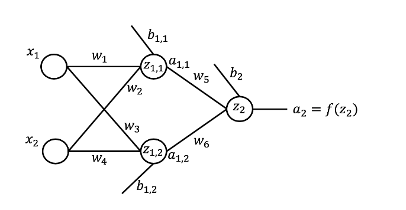

## The implementation for a [feedforward neural network](https://github.com/Yukti-09/Artificial-Neural-Networks/blob/master/Feedforward%20Network/Feedforward.ipynb) with the architecture of 2:2:1 (as shown below):

(The image is obtained from the IBM DL0101EN course on Deep Learning Fundamentals with Keras.) 

#### The activation function (a11 , a12 , a2) used is the [Sigmoid](https://github.com/Yukti-09/Artificial-Neural-Networks/blob/master/Activation%20Functions/Sigmoid(without%20inbuilt).m) activation function.
